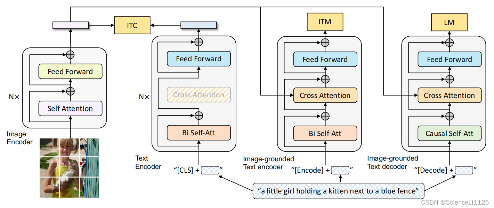

# 项目技术文档--基于图像内容的自然语言搜索实现

在项目的开发过程当中，针对云盘系统中图片文件的管理和检索问题，传统的基于文件名的搜索方式已无法满足用户需求。本文档记录了如何实现基于图像内容的自然语言搜索功能的技术方案与实现过程。

## 项目需求

1. **智能内容识别**：系统需要能够理解图片的实际内容，而非仅依赖文件名进行搜索
2. **自然语言查询**：用户可以使用自然语言描述来搜索图片，如"找一张有猫的图片"、"海边的日落照片"等
3. **高准确率匹配**：确保搜索结果与用户查询意图的高度匹配
4. **实时响应**：在大量图片数据中快速检索并返回相关结果
5. **用户友好性**：提供直观的搜索界面和准确的搜索结果排序

## 技术方案探索

### 1. 初始方案：基于RNN的特征匹配

**实现思路**：
采用卷积神经网络（CNN）对图像进行特征提取，取倒数第12层的4096维向量作为图片特征表示存储进数据库中，然后将该特征与文字查询进行匹配。

**技术细节**：
- 使用预训练的CNN模型进行图像特征提取
- 提取倒数第12层的全连接层输出作为图像的高级语义特征
- 将用户输入的文本查询转换为词向量或TF-IDF特征
- 通过余弦相似度或其他距离度量方法计算图像特征与文本特征的相似度

**存在问题**：
- **语义理解能力有限**：RNN提取的图像特征主要侧重于视觉特征，缺乏对图像内容的语义理解
- **跨模态匹配困难**：图像特征和文本特征处于不同的特征空间，直接匹配效果不佳
- **查询灵活性差**：难以处理复杂的自然语言查询，如包含多个对象、动作或场景描述的查询
- **准确率不高**：由于缺乏深层的语义理解，搜索结果往往不够精确

### 2. 改进方案：基于CLIP的图文检索模型

**实现思路**：
采用CLIP（Contrastive Language-Image Pre-training）模型实现图像和文本的统一嵌入，通过对比学习将图像和文本映射到同一语义空间。

**技术优势**：
- **统一的多模态表示**：将图像和文本映射到同一特征空间，便于直接计算相似度
- **强大的零样本能力**：无需针对特定场景进行微调，即可处理各种类型的图像和查询
- **丰富的语义理解**：基于大规模图文对数据训练，具备强大的跨模态语义理解能力

**实现挑战**：
- **计算资源需求高**：CLIP模型相对较大，对计算资源和推理时间有一定要求
- **中文支持限制**：原生CLIP模型主要针对英文训练，中文支持可能不够完善

### 3. 最终方案：BLIP + Qianwen-Max的两阶段处理

针对前述方案的局限性，项目最终采用了BLIP模型结合Qianwen-Max大语言模型的两阶段处理方案。

**实现思路**：
- **第一阶段**：使用BLIP（Bootstrapping Language-Image Pre-training）模型对图片进行内容理解，生成详细的图像描述
- **第二阶段**：采用Qianwen-Max大语言模型将用户的自然语言查询与生成的图像描述进行语义匹配

**优势**：
- **深度内容理解**：BLIP模型能够生成丰富、准确的图像描述，包含图像中的对象、场景、动作等信息
- **强大的语言理解能力**：Qianwen-Max具备优秀的中文理解和推理能力，能够处理复杂的自然语言查询
- **高精度匹配**：两阶段处理确保了查询意图与图像内容的精确匹配
- **良好的可扩展性**：可以根据需要调整图像描述的详细程度和匹配策略

## 最终方案技术详解

### 1. BLIP模型技术原理

  

**BLIP简介**：
BLIP是一个用于统一视觉-语言理解和生成的预训练框架，通过自举式标题生成和过滤技术，在图像-文本对上进行训练。


**1. 三个主要模块**

**Image Encoder（图像编码器）**
  - 使用Vision Transformer架构
  - 将输入图像分割成patches并编码为视觉特征
  - 通过Self Attention机制捕获图像内部的空间关系

**Text Encoder（文本编码器）**
  - 基于BERT架构的双向编码器
  - 使用Bi Self-Att（双向自注意力）机制
  - 处理文本序列"[CLS] + 文本内容"
  - 通过Cross Attention与图像特征进行交互

**Image-grounded Text Decoder（基于图像的文本解码器）**
  - 采用Causal Self-Att（因果自注意力）机制
  - 用于生成任务，如图像描述生成
  - 通过Cross Attention机制融合图像信息

**2. 三个预训练目标**

**ITC (Image-Text Contrastive Learning)**
- 图像-文本对比学习
- 学习图像和文本的全局表示对齐
- 用于图文匹配任务

**ITM (Image-Text Matching)**
- 图像-文本匹配
- 判断图像和文本是否匹配
- 通过融合特征进行二分类

**LM (Language Modeling)**
- 语言建模任务
- 基于图像生成文本描述
- 采用自回归方式生成文本

**3. 架构特点**

- **统一框架**：同一个模型可以处理理解和生成任务
- **多任务学习**：三个预训练目标相互促进
- **跨模态交互**：通过Cross Attention实现图像和文本的深度融合
- **灵活应用**：可以根据下游任务选择不同的模块组合

### 2. Qianwen-Max大语言模型

**模型特点**：
- **强大的中文理解能力**：专门针对中文进行优化，能够准确理解中文语义和语法
- **推理能力强**：具备逻辑推理、常识推理等高级认知能力
- **上下文理解**：能够理解长文本上下文，准确把握查询意图

**在本项目中的应用**：
- **语义匹配**：将用户查询与图像描述进行深层语义匹配
- **意图理解**：理解复杂、模糊的自然语言查询意图
- **结果生成**：基于匹配程度输出可能符合条件的结构

### 3. 系统架构设计

**整体架构**：

```
用户查询输入 → 查询预处理 → 语义匹配引擎 → 结果生成 → 返回搜索结果
                     ↑
图像库 → BLIP描述生成 → 描述存储 → 描述索引建立
```


### 4. 具体实现

#### 4.1 图像描述生成

**BLIP模型配置**：
```python
、def generate_caption(image_path, blip_path, condition_text="a photography of"):

    processor = BlipProcessor.from_pretrained(blip_path)
    model = BlipForConditionalGeneration.from_pretrained(blip_path)

    try:
        # 验证文件存在性
        if not os.path.exists(image_path):
            return f"错误：文件不存在 - {image_path}"
            
        # 加载并转换图像
        raw_image = Image.open(image_path).convert('RGB')
        
        # 图像描述生成
        inputs = processor(raw_image, condition_text, return_tensors="pt")
        out = model.generate(**inputs)
        return processor.decode(out[0], skip_special_tokens=True)
        
    except (IOError, OSError) as e:
        return f"图像处理失败: {str(e)}"
    except Exception as e:
        return f"未知错误: {str(e)}"
```

#### 4.2 语义匹配实现

**Qianwen-Max集成**：
```java
    @Override
    public List<FinalFile> searchFilesByQianwen(String keyword, Integer userId) {
        List<FinalFile> files = fileMapper.getAllFilesByUserId(userId);
        String question = "请根据下面的疑问信息和用户的查找输入，给出可能符合条件的结果的文件名称，用英文逗号（,）分割多个文件名，回答形式如：file1,file2,file3。"
                + "回答应只有如示例所示的文件名，不可包括其他任何内容，若没有符合条件的文件，请回答“没有满足条件的文件”\n" + keyword + "\n" + files.toString();

        try {
            String response = QianwenHelper.processMessage(question);

            if (response == null || response.isEmpty() || response.equals("没有满足条件的文件")) {
                return new ArrayList<>();
            }

            List<String> matchedFilenames = Arrays.asList(response.split(","))
                    .stream()
                    .map(String::trim)
                    .collect(Collectors.toList());

            return files.stream()
                    .filter(file -> matchedFilenames.contains(file.getFilename()))
                    .collect(Collectors.toList());

        } catch (NoApiKeyException | InputRequiredException e) {
            throw new RuntimeException(e);
        }
    }
```
