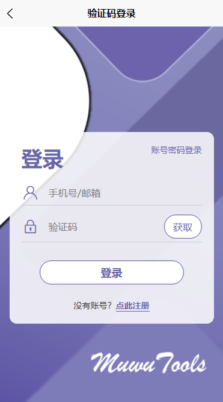

## 木屋--用户手册

- [木屋--用户手册](#木屋--用户手册)
  - [一. 应用简介](#一-应用简介)
  - [二、应用环境及语言支持](#二应用环境及语言支持)
  - [三. 应用功能](#三-应用功能)
  - [四. 使用流程](#四-使用流程)
    - [1. 登录](#1-登录)
    - [2. 注册](#2-注册)
    - [3. 上传文件](#3-上传文件)
    - [4. 查看文件](#4-查看文件)
    - [5. 文件操作](#5-文件操作)
    - [6. 搜索文件](#6-搜索文件)
    - [7. 分享记录](#7-分享记录)
    - [8. 标签管理](#8-标签管理)

### 一. 应用简介

木屋是一个只能的云盘工具箱，通过整合大模型及相关工具实现文件自动存放，分类管理，同时也兼具云盘基本的上传，预览，下载，分享等功能，提供一个高效的文件管理平台。

### 二、应用环境及语言支持

操作系统：web，app
语言：简体中文

### 三. 应用功能

- 多格式文件存储与预览：上传，在线预览Word、PDF、Markdown、图片、代码文件等。  
- 智能云存储：文件云存储
- 高效文件分享：生成链接或二维码，支持跨平台一键分享 
- 智能分类与搜索：AI自动分类文件，支持关键词/标签快速检索，支持自然语言搜索  
- 附加工具链：  
  - 文件格式转换（如PDF转Word、markdown生成思维导图）。  
  - OCR文字识别（图片/扫描件转文本）。
  - SR图片超分

### 四. 使用流程

#### 1. 登录

**账号密码登录**

  

在账号密码登录页面，输入自己的账号和密码，点击登录按钮，进行登录
其中账号可以使用邮箱、手机号、用户ID进行登录

**验证码登录**

点击账号密码登录输入框右上角的验证码登录，跳转验证码登录页面

  

输入邮箱（手机号目前不支持），点击获取验证码，输入验证码，点击登录

#### 2. 注册

点击登录输入框下方的点此注册，跳转注册页面

  

输入你的手机号和邮箱后点击获取验证码，验证码会发送到你的邮箱，输入验证码，然后再输入密码，点击注册

#### 3. 上传文件

进入上传页面，点击页面左上角进入选择文件页面

  

此处以上传一张图片为例，选择上传后服务器会分析你的当前云盘文件树结构，结合上传文件内容给出一个建议存放路径，同时结合你的预设分类标签，给出对于上传文件的建议分类标签。上述两个内容你都可以自己修改，无误后点击确认完成文件上传。

  

之后服务器会按照你确认的路径和标签保存文件，然后ai会根据你上传的文件，给出对应的建议（有的文件可能没有），如此处上传了一张富文本图片，会询问你是否要提取图片文本。

  

你可以拒绝或者接受，如果接受，ai会再返回处理的结果

  

#### 4. 查看文件

再云盘界面你可以查看你浏览你上传的文件，如，我们可以再刚才提交的目录找到上传的图片以及ai处理的ocr结果文件

  

#### 5. 文件操作

选中某个文件，你可以对其执行删除，分享或相应的操作，此处以分享为例

  

点击分享会生成对应的二维码和链接，你可以复制链接或保存二维码，分享给需要的人

  

#### 6. 搜索文件

云盘处的搜索，除了普通的基于文件名的查询意外，我们还支持基于文件内容的搜索，以及自然语言的搜索，如输入"照片内容为湖泊的图片"，结果如下

  

搜索出的两张图片如下所示：

  

成功输出了内容为"湖泊"的图片

#### 7. 分享记录

在我的页面你可以点击查看分享记录，可以再次获取分享的文件的二维码

  

#### 8. 标签管理

你可以在我的页面点击分类管理，添加，修改或删除你的标签，我们的标签分为了两大类，一类是针对图片的，一类是针对文件的。

  

---

注：
1. 因为新建文件夹的功能为实现，所以为了更好的体现自动确定路径的功能，建议先自行在服务器的用户文件夹每新建几个空文件夹
2. 避免手动往服务器用户文件夹内添加文件（可以添加空文件夹），不然会导致file/list接口报错
3. 部分功能因时间原因尚未实现：分享记录处的搜索，修改个人信息，关于我们以及因为算力和数据集有限，所以图片超分功能的模型效果较差