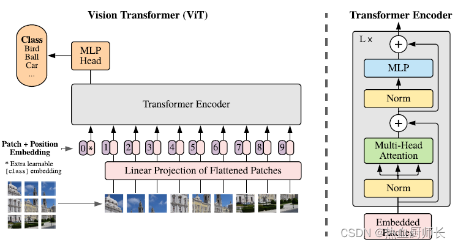
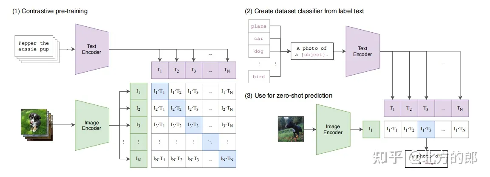

# 项目技术文档--如何实现图像分类与自动打标签

在项目的开发过程当中，就如何实现图像分类与自动打标签遇到了一些问题，这里记录下一些想法与最总解决方案及其相关技术

### **项目的需求**

1. **高准确率的图像分类与标签生成**：系统需能够准确识别图片内容，并对应到相应的分类标签。
2. **标签的动态管理**：支持用户随时添加、修改或删除标签
3. **可扩展性与维护性**：系统结构需具备良好的可扩展性，方便后期功能扩展与维护。

### 1. 初始方案：基于RNN的分类模型

**实现思路**：
采用卷积神经网络（CNN）训练一个多标签分类模型，对输入图像进行特征提取后，通过CNN进行分类预测，生成相应的标签。

**存在问题**：
- **标签动态修改困难**：一旦用户对标签进行了修改或新增操作，需要对整个模型进行重新训练，耗费大量时间和资源
- **缺乏新标签的数据集**：对于新添加的标签，缺少足够的训练数据，导致模型无法准确识别，影响系统整体性能
- **扩展性差**：随着标签数量的增加，模型的复杂度和训练难度显著提升，不利于系统的持续优化

### 2. 改进方案：基于ViT-B-32的图文匹配模型

针对初始方案中的问题，在查阅相关资料后决定采用Vision Transformer（ViT）基础的图文匹配模型——ViT-B-32，替代传统的CNN分类模型。

**实现思路**：
- **图像特征提取**：使用ViT-B-32模型对输入图像进行特征提取，生成高维图像表示向量。
- **文本特征嵌入**：将用户预定义的分类标签进行文本嵌入，生成相应的文本向量。
- **图文匹配机制**：通过计算图像向量与文本向量之间的相似度，实现图像与标签的匹配，从而生成自动标签。
- **动态标签支持**：由于标签的文本表示是独立的，可以随时添加或修改标签，而无需重新训练图像特征提取模型，极大地提高了系统的灵活性和可维护性。

**优势**：
- **灵活性高**：支持标签的动态添加和修改，适应业务需求的变化。
- **减少训练成本**：无需频繁重新训练模型，节省计算资源和时间。
- **良好的可扩展性**：新标签只需生成相应的文本向量，与现有图像特征进行匹配即可，系统扩展性强。
- **提升准确率**：ViT模型在图像特征提取方面表现优异，结合图文匹配机制，提升了标签生成的准确性。

### 3. 可选方案

除了基于ViT的图文匹配模型外，我们还查阅到了以下几种方案，再此做以记录

#### 3.1 基于CLIP的多模态模型

CLIP（Contrastive Language–Image Pre-training）模型由OpenAI提出，能够同时处理图像和文本输入，通过对比学习方式训练图文表示向量，使得图像与其描述的文本向量在嵌入空间中接近。

**优势**：
- **强大的跨模态理解能力**：可处理复杂的图像与文本匹配任务。
- **广泛的预训练知识**：充分利用大规模预训练数据，提升模型泛化能力。

该模型虽然应为模型复杂，在该功能中没有采用，但是为我们之后的基于图片内容的搜索提供了思路

#### 3.2 基于孪生网络的图像相似度学习

采用孪生网络（Siamese Network）架构，通过两个共享参数的神经网络分别处理图像和标签文本，学习其相似度度量函数，实现图像与标签之间的匹配。

**优势**：
- **高效的相似度计算**：适用于大规模图像与标签匹配任务。
- **灵活的模型结构**：便于调整和优化网络结构以适应不同需求。

### 最终方案选择

经过综合分析，最终确定采用基于ViT-B-32的图文匹配模型作为图像分类与自动打标签的核心技术方案。该方案在满足动态标签管理的同时，兼顾了模型的准确性和系统的可扩展性。

### 技术详解

#### 1. Vision Transformer (ViT-B-32)

  

Vision Transformer（ViT）是将Transformer应用于计算机视觉任务的一种模型架构。ViT-B-32表示使用基本版本的ViT模型，并采用32×32的图像补丁分割。

**工作原理**：
- **图像分割**：将输入图像划分为固定大小的补丁（例如32×32像素），并将每个补丁展平后线性嵌入。
- **位置编码**：为每个补丁添加位置信息，保留图像的空间结构信息。
- **Transformer编码器**：通过多层Transformer编码器处理补丁嵌入，捕捉图像中的全局依赖关系。
- **特征输出**：模型输出图像的全局特征向量，用于后续的图文匹配。

#### 2. 图文匹配技术

**实现原理**：
图文匹配技术通过将图像和文本分别嵌入到同一向量空间中，计算其相似度，以判断图像与文本描述的关联程度。

  

**具体步骤**：

1. **数据嵌入**：
- 图像嵌入：使用ViT-B-32模型将输入图像转换为高维图像向量。
- 文本嵌入：使用预训练的文本编码器（如BERT、RoBERTa等）将预定义的分类标签转换为文本向量。

2. **特征对齐**：
- 将文本特征和图像特征映射到同一特征空间
- 使用注意力机制实现跨模态特征的交互和对齐
- 通过度量学习方法计算特征之间的相似度

3. **匹配判断**：
- 基于特征相似度进行匹配度评估
- 设定阈值判断是否匹配
- 输出匹配概率或匹配结果

